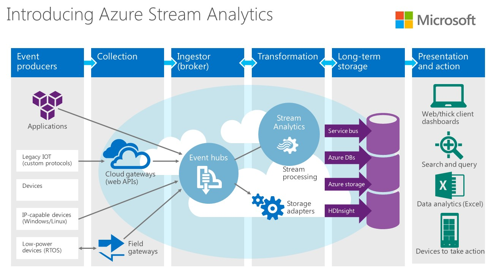

# Consulting

A consultant is a professional who provides expert advice in a particular area. A Data Engineer 🔢 👨‍🔧 may provide expert advice in implementing new solutions from the ground up, or improving existing solutions. I both cases, it is valuable to translate business requirements into a high level architectural blueprint.



## 1. Basics

Does the system have to be real-time? What's the minimal required response time? What kind of skills does the team poses? Is performance more important than readability? Should data be available and highly consistent? Is there enough time, or enough money? Is the selected solution robust, flexible, secure?

| Advice | Elucidation |
| :--- | :--- |
| **There is always a trade-off** | The trade-offs are sometimes hard to find, and balancing occurs while developing a system. There are no silver bullets. Don't give answers you don't have. Research pros and cons, make an informed decision. |
| **Take maturity into account** | Mature technologies are often more stable, and easier to implement because of greater adoption among adjacent technologies |
| **Make services as isolated as possible** |  |
| **Avoid premature optimizations** | It is considered as breaking [YAGNI](jargon.md). Choosing Parquet over CSV for example, just because it is performing better. You can always make this choice later. |
| **Write tests before refactoring** | This way you can safely modify code, and verify that the output is still exactly the same. |
| **Avoid single points of failure** |  |
| **Start stateless** |  |

## 2. Technologies

The number of possible combinations between different technologies is vast. Take a look at the following **technologies** within each **subject**:

* [Databases](https://github.com/igorbarinov/awesome-data-engineering#databases)
* [Data Ingestion](https://github.com/igorbarinov/awesome-data-engineering#data-ingestion)
* [File System](https://github.com/igorbarinov/awesome-data-engineering#file-system)
* [Serialization Format](https://github.com/igorbarinov/awesome-data-engineering#serialization-format)\*\*\*\*
* [Stream Processing](https://github.com/igorbarinov/awesome-data-engineering#stream-processing)
* [Batch Processing](https://github.com/igorbarinov/awesome-data-engineering#batch-processing)
* [Charts and Dashboards](https://github.com/igorbarinov/awesome-data-engineering#charts-and-dashboards)
* [Workflow](https://github.com/igorbarinov/awesome-data-engineering#workflow)
* [Monitoring](https://github.com/igorbarinov/awesome-data-engineering#monitoring)

Now, if you give a **piece of advice** that turned out to be **wrong**, you lose all credibility. So how do you go about making crucial architectural decisions? First, you should be aware that these **subjects** exist, second you should know some advantages and disadvantages of some **technologies** of each subject.

You can do this by reading the rest of this chapter!

## 3. Databases

A Data Engineer must be aware of the physical limitations with respect to data. For example, it is physically impossible to read a couple of records with top consistency from a **distributed database** under 150 microseconds.

### Relational VS Non Relational

There are some big differences between relational and non relational databases, although it heavily relies on the DB implementation:

<table>
  <thead>
    <tr>
      <th style="text-align:left"></th>
      <th style="text-align:left">Relational</th>
      <th style="text-align:left">Non Relational</th>
    </tr>
  </thead>
  <tbody>
    <tr>
      <td style="text-align:left">Storage</td>
      <td style="text-align:left">Tables and rows</td>
      <td style="text-align:left">JSON documents</td>
    </tr>
    <tr>
      <td style="text-align:left">Language</td>
      <td style="text-align:left">SQL</td>
      <td style="text-align:left">depends on implementation</td>
    </tr>
    <tr>
      <td style="text-align:left">Consistency</td>
      <td style="text-align:left">Consistent</td>
      <td style="text-align:left">Eventually Consistent</td>
    </tr>
    <tr>
      <td style="text-align:left">Structure</td>
      <td style="text-align:left">Structured Normalized (foreign keys and indexes), rigid data model</td>
      <td
      style="text-align:left">Semi-Structured Denormalized (related data stored in same document), no
        schema model</td>
    </tr>
    <tr>
      <td style="text-align:left">Advantages</td>
      <td style="text-align:left">
        <ul>
          <li>Complicated querying</li>
          <li>Reliable ACID transactions</li>
          <li>Relationship constraints</li>
          <li>Operations are treated as transactions automatically</li>
          <li>Query routine analysis</li>
          <li>Referential integrity (cascading)</li>
        </ul>
      </td>
      <td style="text-align:left">
        <ul>
          <li>Information that belongs together is stored together</li>
          <li>No SQL injection</li>
          <li>Easy sharding</li>
          <li>No schema validation allows for experimenting</li>
          <li>High availability</li>
          <li>Open source</li>
        </ul>
      </td>
    </tr>
    <tr>
      <td style="text-align:left">Disadvantages</td>
      <td style="text-align:left">
        <ul>
          <li>Doesn't scale that well</li>
          <li>Normalization means lots of joins, which may affect speed</li>
          <li>Hard to work with semi-structured data</li>
        </ul>
      </td>
      <td style="text-align:left">
        <ul>
          <li>Limited support for joins</li>
          <li>Limited indexing</li>
          <li>Denormalization means mass update</li>
          <li>Manually handle transactions</li>
          <li>Nested documents are hard to keep consistent</li>
          <li>No schema validation may leave DB in invalid state</li>
          <li>Weaker consistency (BASE)</li>
        </ul>
      </td>
    </tr>
    <tr>
      <td style="text-align:left">Schema</td>
      <td style="text-align:left">Predefined</td>
      <td style="text-align:left">Programmatically</td>
    </tr>
    <tr>
      <td style="text-align:left">Scaling</td>
      <td style="text-align:left">Mostly vertical (improving machine), high cost, and a limitation to the
        level of scaling</td>
      <td style="text-align:left">
        <p>Horizontal (adding more machines), low cost, can handle high number of
          operations</p>
        <p></p>
      </td>
    </tr>
    <tr>
      <td style="text-align:left">Maintenance</td>
      <td style="text-align:left">Expensive, requires trained workforce</td>
      <td style="text-align:left">Cheap, automatic repair and easier distribution</td>
    </tr>
    <tr>
      <td style="text-align:left">Caching</td>
      <td style="text-align:left">Separate hardware</td>
      <td style="text-align:left">Integrated</td>
    </tr>
  </tbody>
</table>You generally choose a relational database when ACID compliance must be ensured, and when your data is structured and unchanging. But, most importantly, it is not Big Data.

If there's little structure, and the DB must handle large VVV data, a NoSQL database is a better choice. Also, the lack of schema and migrations allows for quick development. To choose which NoSQL DB is best suited for your use case, this interesting decision tree may be useful:


Key-Value stores \(Redis\) are super fast in memory stores. Document stores \(MongoDB\) are super flexible schemaless stores with built-in features and query system, a RDBMS replacement. Wide-Column stores \(Cassandra\) are super capable of heavy writes and real-time querying, good when you are dealing with massive data, real-time.

### CAP

A distributed database that continues to operate when network partitions occur is considered to be partition tolerant. As a consequence, data that is read from one partition may differ from the other, meaning that consistency isn't guaranteed, but the database is available. Not unless you are talking about "eventual consistency", which implies that it takes some time to synchronize. Consider the order of magnitudes between different network operations here:



```swift
           0.5 ns - CPU L1 dCACHE reference
           1   ns - speed-of-light (a photon) travel a 1 ft (30.5cm) distance
           5   ns - CPU L1 iCACHE Branch mispredict
           7   ns - CPU L2  CACHE reference
          71   ns - CPU cross-QPI/NUMA best  case on XEON E5-46*
         100   ns - MUTEX lock/unlock
         100   ns - own DDR MEMORY reference
         135   ns - CPU cross-QPI/NUMA best  case on XEON E7-*
         202   ns - CPU cross-QPI/NUMA worst case on XEON E7-*
         325   ns - CPU cross-QPI/NUMA worst case on XEON E5-46*
      10,000   ns - Compress 1K bytes with Zippy PROCESS
      20,000   ns - Send 2K bytes over 1 Gbps NETWORK
     250,000   ns - Read 1 MB sequentially from MEMORY
     500,000   ns - Round trip within a same DataCenter
  10,000,000   ns - DISK seek
  10,000,000   ns - Read 1 MB sequentially from NETWORK
  30,000,000   ns - Read 1 MB sequentially from DISK
 150,000,000   ns - Send a NETWORK packet California -> Netherlands
|   |   |   |
|   |   | ns|
|   | us|
| ms|
```



For this reason, the CAP theorem states that **networked shared-data systems** can only guarantee/strongly support two of the following three properties:

* **Consistency:** every read receives the most recent write or an error
* **Availability:** every request receives a reasonable response within a reasonable amount of time
* **Partition Tolerance:** the system will continue to function when network partitions occur

Because networks are not reliable, and eventual consistency is never instant, we must tolerate partitions in a distributed system. So we are left with the following two choices:

* **CP:** wait for a response from the partitioned node which could result in a timeout error. The system can also choose to return an error, depending on the scenario you desire. \(Choose Consistency over Availability when your business requirements dictate atomic reads and writes\)
* **AP:** return the most recent version of the data you have, which could be stale. This system state will also accept writes that can be processed later when the partition is resolved. \(Choose when consistency is not crucial\)
* **CA:** highly available and consistent, but not partition tolerant \(Choose when you can't have network partitions\)

### Transactions, ACID and BASE

ACID is an acronym that describes database transaction properties \(pessimistic replication model\):

* **Atomicity:** guarantees that each transaction is handled as a single unit. A transaction consisting of multiple statements either succeeds completely \(a change\), or fails completely \(no change\).
* **Consistency:** ensures validity of database with constraints, cascades, and triggers.
* **Isolation:** ensures concurrent transactions to leave the database state as if they were executed sequentially.
* **Durability:** guarantees that once a transaction has been committed, it will remain committed even in case of a system failure.

BASE is an acronym that describes eventually consistent services \(optimistic replication model\):

* **Basically Available:** means that any data request should receive a response, but that the response may indicate a failure instead of the requested data.
* **Soft State:** given eventual consistency, the system may be in a changing state until consistency is reached
* **Eventual Consistency:** describes the situation where a DDBS achieves high availability while loosely guaranteeing that data, in the absence of updates, will eventually reflect the last updated value across the system, and therefore the data may vary in value until the system reaches a consistent state.

## 4. Data Ingestion

When moving data, especially unstructured data, from where it is originated into a system where it can be stored and analyzed, we are talking about ingestion. This process may be continuous or asynchronous, real-time or batched, from a wide variety of data sources.

### Batch Transferring

Data can be ingested in a batch. Apache Sqoop is capable to efficiently transfer bulk data between Apache Hadoop and structured datastores such as relational databases. Embulk helps transfer data between various databases, storages, file formats, and cloud services.

### Real-time Messaging

Then there's real-time data ingestion. When many sources are sending data to your API's, and your API goes down, the data is lost, and the application may show errors. If you put a message broker in between the application and API, the data is temporarily stored so that the API can access it when it's up again. This may also be useful when you want to replace or update an API or service. It **decouples** processing from data producers.

Great use cases for messaging are:

* Website Activity Tracking
* Collecting Metric Data
* Log Aggregation
* Stream Processing
* Event Sourcing
* Commit Log

[Kafka](technologies/kafka.md), for example, allows **producers** to publish a stream of records to one or more topics, and allows **consumers** to subscribe to one or more topics, while processing the stream for them.

## 5. File System

File Systems such as [HDFS](technologies/hadoop.md) and [AWS](cloud-services/aws.md) S3 are used to store files. In the context of Data Engineering, files may be large files of data, not just images or videos. It may be used to store serialized files, described in the next section.

When would you need a File System? When you want to store or process massive files using [Spark](technologies/spark.md) for example. 

|  | S3 | HDFS |
| :--- | :--- | :--- |
| Elasticity | Yes | No |
| Cost/TB/Month | $23 | $206 |
| Availability | 99.99% | 99.9% |
| Durability | 99.999999999% | 99.9999% |
| Transactional writes | Yes with DBIO | Yes |

## 6. Serialization Format

The files that you store on the file system may be stored in a particular format. How do you choose the right format?

* What type of data do you have?
* Is the desired format compatible with your processing tools?
* What are your file sizes?
* Do you have to be able to split the files for map-reduce style processing?
* Do the schema's evolve over time?

<table>
  <thead>
    <tr>
      <th style="text-align:left">Format</th>
      <th style="text-align:left">Advantages</th>
      <th style="text-align:left">Use Case</th>
    </tr>
  </thead>
  <tbody>
    <tr>
      <td style="text-align:left">
        <p>Text</p>
        <p>CSV</p>
        <p>TSV</p>
      </td>
      <td style="text-align:left">
        <p>Readable</p>
        <p>Easy to implement</p>
      </td>
      <td style="text-align:left">Adding large amounts of data to HDFS quickly</td>
    </tr>
    <tr>
      <td style="text-align:left">JSON</td>
      <td style="text-align:left">Dictionary-like</td>
      <td style="text-align:left">Applications</td>
    </tr>
    <tr>
      <td style="text-align:left">Avro</td>
      <td style="text-align:left">
        <p>Schema evolution (allows schema change)</p>
        <p>Serialization</p>
        <p>Row-based binary format</p>
        <p>Block compression</p>
        <p>Splittable</p>
      </td>
      <td style="text-align:left">
        <p>Event data that changes over time</p>
        <p>Adding, removing, renaming columns later</p>
      </td>
    </tr>
    <tr>
      <td style="text-align:left">SEQ</td>
      <td style="text-align:left">
        <p>Row oriented</p>
        <p>Splittable</p>
        <p>Block compression</p>
      </td>
      <td style="text-align:left">Sharing datasets between MR jobs</td>
    </tr>
    <tr>
      <td style="text-align:left">Parquet</td>
      <td style="text-align:left">
        <p>Column-based binary format</p>
        <p>Quick column access</p>
        <p>Block compression</p>
        <p>Append data</p>
        <p>Optimized for reading</p>
      </td>
      <td style="text-align:left">
        <p>Column specific queries
          <br />Adding columns later
          <br />
        </p>
        <p></p>
      </td>
    </tr>
    <tr>
      <td style="text-align:left">ORC</td>
      <td style="text-align:left">
        <p>Splittable</p>
        <p>Block compression</p>
        <p>Lightweight indexing</p>
        <p>Optimized for reading</p>
      </td>
      <td style="text-align:left">Column specific queries</td>
    </tr>
  </tbody>
</table>There's the idea of wide and narrow datasets:

* **Narrow:** 10 million rows, 10 columns
* **Wide:** 4 million rows, 1000 columns

## 7. Stream Processing

Stream processing is a paradigm, equivalent to reactive programming, allowing for more parallelism. A stream is an unbounded sequence of something. In order to process an endless sequence of data, you would have to cut the sequence somewhere, store it, then process it, and then do the next batch and worry about aggregating the data at some point. In some cases speedy results are desired.

### Native Streaming

Storm, Flink, Kafka Streams, and Samza, can process every record as it arrives. Native Streaming feels natural as every record is processed as soon as it arrives, allowing the framework to achieve the minimum latency possible. But it also means that it is hard to achieve fault tolerance without compromising on throughput as for each record, we need to track and checkpoint once processed. Also, state management is easy as there are long running processes which can maintain the required state easily.

### Micro Batching

Spark Streaming, Storm-Trident, micro batch records, introducing a small delay. Fault tolerance comes for free as it is essentially a batch and throughput is also high as processing and check-pointing will be done in one shot for group of records. But it will be at some cost of latency and it will not feel like a natural streaming. Also efficient state management will be a challenge to maintain.

## 8. Batch Processing

If results are required only once an hour or once a day, it may not be required to set up and maintain a streaming solution. In this case, data may be appended to a parquet file, and processed overnight. But processing all this data may take days, or weeks. For this problem, [Hadoop](technologies/hadoop.md) was brought into existence. Map-Reduce in combination with HDFS is able to process distributed data in a distributed fashion, in which it writes intermediate results to disk, which was a slow process. [Spark](technologies/spark.md) introduced in-memory processing, which drastically improved performance, because it only had to write the end result to HDFS or some other data source. That brings us to scheduling!

## 10. Workflow

Airflow is one such scheduling tool, it uses your defined DAG's to schedule tasks, which you can keep track of in the web interface:

```bash
# airflow needs a home, ~/airflow is the default,
# but you can lay foundation somewhere else if you prefer
# (optional)
export AIRFLOW_HOME=~/airflow

# install from pypi using pip
pip install apache-airflow

# initialize the database
airflow initdb

# start the web server, default port is 8080
airflow webserver -p 8080

# start the scheduler
airflow scheduler

# visit localhost:8080 in the browser and enable the example dag in the home page
```

A DAG is defined in a python file:

```python
dag = DAG(
    'tutorial', default_args=default_args, schedule_interval=timedelta(days=1))
```

Other scheduling tools are available, mostly depending on the cloud platform that you're using.

